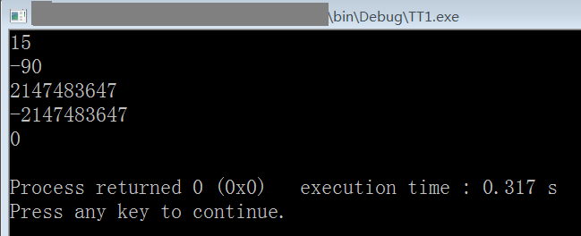

# C 语言实现整数转字符串

```c
#include <stdio.h>

void intToString(int N,char arr[]){
    //仅支持有符号4字节的int类型，范围-2147483648 - 2147483647
    int i,j,flag;
    char stack[10]; //栈，int的最值最多10位
    i=0; //计数器
    if (N<0){
        flag=0; //N是负数
        N=-N;
        //把N转为正数，注意，如果N是-2147483648，那么N=-N的结果还是-2147483648
        //因为-N表达式将-2147483648转为2147483648，而2147483648对于4字节int来说是溢出的，这个溢出的数又变成了-2147483648
        //这时，程序会计算异常
        //解决方法，可以在函数开始时加个if语句，将这个值排除或当作特例
    }else{
        flag=1; //N是正数
    }
    while (N/10!=0){//说明N还不是一位数，继续拆
        stack[i]=(char)(48+N%10); //字符的1 - 数字的1 = 48，N%10获取N的个位数，并把转换后的字符入栈
        N=N/10;
        i++;
    }
    stack[i]=(char)(48+N); //当循环结束，N必定是一个一位数
    if (flag==0){//如果N是负数，需要在字符串最前面加负号
        arr[0]='-';
        for (j=i;j>-1;j--){//将栈中的字符出栈，j=i+1是因为数组arr的0元素已经保存负号了
            arr[i-j+1]=stack[j];
        }
        arr[i+2]='\0'; //添加字符串结束标志
    }else{
        for (j=i;j>-1;j--){//将栈中的字符出栈
            arr[i-j]=stack[j];
        }
        arr[i+1]='\0';
    }
}

int main(){
    char myarr[15];
    /* 测试 */
    intToString(15,myarr);
    printf("%s\n",myarr);
    intToString(-90,myarr);
    printf("%s\n",myarr);
    intToString(2147483647,myarr);
    printf("%s\n",myarr);
    intToString(-2147483647,myarr);
    printf("%s\n",myarr);
    intToString(0,myarr);
    printf("%s\n",myarr);
    return 0;
}
```

运行截图：



> 2020-02-07
