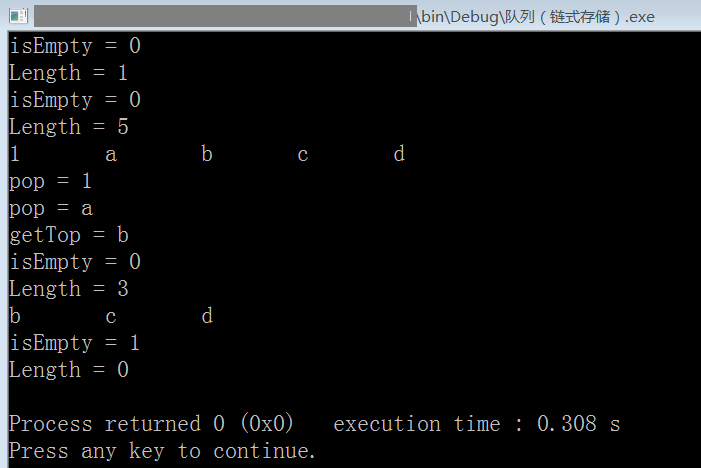

# 队列的链式存储结构（C 语言实现）

```c
#include <stdio.h>
#include <stdlib.h>

#define OK 1
#define ERR 2
#define TRUE 1
#define FALSE 0

typedef int status; //定义函数返回的状态，OK & ERR
typedef char datatype; //定义队列中每个元素的数据类型，这里暂定为字符型

typedef struct LinkQueue_anon{
    datatype data; //数据区
    struct LinkQueue_anon * next; //指针区
} LinkQueue;
typedef struct {
    LinkQueue * front, * rear;
    /*
    创建队列的游标，保存着队列的头尾指针所指向的结点
    front指向队列的第一个结点（队头），rear指向队列的最后一个结点（队尾）
    规定：
        当front=rear=NULL时，表示队列为空
        当front=rear!=NULL时，表示队列只有一个元素
    */
}LinkQueueCursor;

/* 函数原型，队列的基本操作，与栈相同 */
LinkQueueCursor *createLinkQueue(datatype first_node_value);
status isEmpty(LinkQueueCursor *L);
void clear(LinkQueueCursor *L);
datatype getTop(LinkQueueCursor *L);
int getLength(LinkQueueCursor *L);
status push(LinkQueueCursor *L, datatype node_to_push);
datatype pop(LinkQueueCursor *L);
void showQueue(LinkQueueCursor *L);

int main(){
    /* 测试 */
    LinkQueueCursor * mycursor;
    mycursor=createLinkQueue('1'); //创建一个游标，同时入队一个元素，其值为'1'
    printf("isEmpty = %d\n",isEmpty(mycursor));
    printf("Length = %d\n",getLength(mycursor));
    push(mycursor,'a');
    push(mycursor,'b');
    push(mycursor,'c');
    push(mycursor,'d');
    printf("isEmpty = %d\n",isEmpty(mycursor));
    printf("Length = %d\n",getLength(mycursor));
    showQueue(mycursor);
    putchar('\n');
    printf("pop = %c\n",pop(mycursor));
    printf("pop = %c\n",pop(mycursor));
    printf("getTop = %c\n",getTop(mycursor));
    printf("isEmpty = %d\n",isEmpty(mycursor));
    printf("Length = %d\n",getLength(mycursor));
    showQueue(mycursor);
    putchar('\n');
    clear(mycursor);
    printf("isEmpty = %d\n",isEmpty(mycursor));
    printf("Length = %d\n",getLength(mycursor));

    return 0;
}

LinkQueueCursor *createLinkQueue(datatype first_node_value){
    LinkQueueCursor *tmp_cur;
    LinkQueue *tmp;
    tmp_cur=malloc(sizeof(LinkQueueCursor)); //void*类型指针能自动转为其他类型的指针
    tmp=malloc(sizeof(LinkQueue));
    tmp_cur->front=tmp_cur->rear=tmp; //初始化游标
    tmp->data=first_node_value; //初始化数据区
    tmp->next=NULL; //初始化指针区
    return tmp_cur;
}
status isEmpty(LinkQueueCursor *L){
    if (L->front==L->rear && L->front==NULL)
        return TRUE;
    else
        return FALSE;
}
void clear(LinkQueueCursor *L){
    LinkQueue * p,* q;
    if (isEmpty(L)) return; //空队列，不需要clear，所以直接返回
    if (L->front==L->rear && L->front!=NULL){ //只有一个元素的队列，front和rear都指向这个元素
        free(L->front);
        L->front=L->rear=NULL; //把队列设为空
        return;
    }
    /* 当队列的元素大于1时 */
    p=L->front; //p指向当前要被删除的结点
    while (p){
        //当p不为NULL继续循环
        q=p->next; //q指向p的下一个结点
        free(p);
        p=q; //交换
    }
    L->front=L->rear=NULL; //把队列设为空

}
datatype getTop(LinkQueueCursor *L){
    return L->front->data; //直接返回队头的数据即可
}
int getLength(LinkQueueCursor *L){
    int i=0;
    LinkQueue * p;
    if (isEmpty(L)) return 0; //空队列，返回0
    if (L->front==L->rear && L->front!=NULL) return 1; //规定：front=rear，说明队列只有一个元素
    /* 队列的长度大于1时 */
    p=L->front;
    while (p!=L->rear){ //还没到rear（队尾）则继续循环
        i++; p=p->next;
    }
    return i+1;
    /*
    上面的【队列的长度大于1时】还能用下面的等价代码代替
    p=L->front;
    while (p){ //p不为NULL则继续循环，因为rear（队尾）结点的next（指针区）一定是NULL
        i++; p=p->next;
    }
    return i;
    */
}
status push(LinkQueueCursor *L, datatype node_to_push){
    //node_to_insert表示想要在队尾处入队的元素
    LinkQueue * s=malloc(sizeof(LinkQueue));
    s->data=node_to_push; //初始化新入队的元素
    s->next=NULL;
    if (isEmpty(L)==TRUE){
        //插入到空队列
        L->front=L->rear=s; //入队，当队列只有一个元素时，规定front和rear都指向这个元素
    }else{
        //插入到已存在元素的队列
        L->rear->next=s; //入队，将新元素附在rear指向的结点的后面
        L->rear=s; //rear后移，即将它指向新元素
    }
    return OK;
}
datatype pop(LinkQueueCursor *L){
    //出队，即将队头删除
    datatype v;
    LinkQueue * s;
    if (isEmpty(L)) return (datatype)ERR; //空队列
    if (L->front==L->rear && L->front!=NULL){ //队列只有一个元素
        v=L->front->data; //把这个元素的值赋值给临时变量
        free(L->front); //删除这个元素
        L->front=L->rear=NULL; //把队列设置为空
    }else{
        v=L->front->data; //将要删除的元素的值先赋值给临时变量
        s=L->front; //将要删除的元素先赋值给临时变量
        L->front=L->front->next; //将游标所保存的front后移到下个结点（元素）
        free(s); //删除原来的头结点（元素）
    }
    return v; //返回出队结点（元素）的值
}
void showQueue(LinkQueueCursor *L){
    int i;
    int total=getLength(L);
    LinkQueue * p;
    p=L->front;
    for (i=0; i<total; i++){
        printf("%c\t",p->data); p=p->next;
    }
}
/*
    队列的定义：只允许在一端进行插入，另一端进行删除的线性表，也是一种操作受限的线性表
    一般，把允许插入的一端叫做队尾，允许删除的一端叫做队头
    不含任何元素的队列就是空队
    所以，队列又称先进先出(First in First out)的线性表
    队列的链式存储其实就是线性表中的单链表，只不过它只能尾进头出
*/
/* 环境: Code::Blocks with GCC 5.1 */
```

运行截图：



> 2020-01-24
