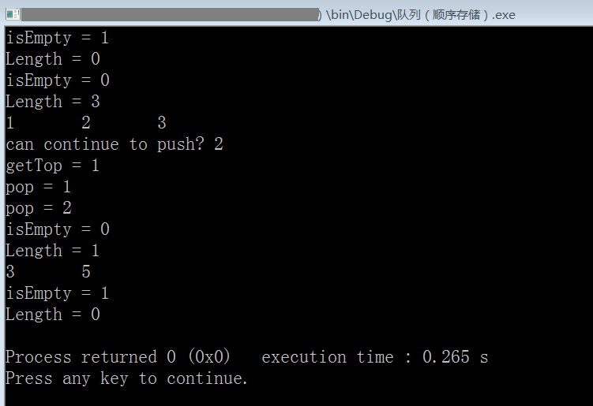

# 队列的顺序存储结构（循环队列）（C 语言实现）

```c
#include <stdio.h>
#include <stdlib.h>

#define OK 1
#define ERR 2
#define TRUE 1
#define FALSE 0
#define MAXSIZE 4 //定义队列的最大长度

typedef int status; //定义函数返回的状态，OK & ERR
typedef char datatype; //定义队列中每个元素的数据类型，这里暂定为字符型

typedef struct {
    datatype data[MAXSIZE]; //存储着队列中的每个元素
    int front, rear; //头指针和尾指针
    /*
    假设用于模拟队列的数组长度为8，规定入队和出队方向都向左（即下标0的元素始终用于出队），有一个指针end永远标识队尾元素的下标，当end=0时表示队列只有一个元素，当end=-1时标识队列为空，类似于栈的top指针，
    现在入队3个元素，数组如下，
    A B C _ _ _ _ _ 指针end=2
    出队1个元素，即下标是0的元素出队，也就是A，
    _ B C _ _ _ _ _ 指针end=2
    这时下标0的元素为空，需要将后面的元素都前移，然后将指针end-1，如果队列很长，这个操作会带来很大开销，所以我们不应该用栈的固定思维去思考队列，也就是说队头不一定要在下标为0的位置，
    这样一来我们定义一个指针front用来表示队头所在元素的下标，再定义一个指针rear用来表示队尾所在元素的下一个元素的下标，当front=rear时表示队列为空，这就是队列的初始状态，
    现在我们用上述队列的存储结构来创建一个新队列，
    _ _ _ _ _ _ _ _ 指针front=0 指针rear=0
    入队3个元素，
    A B C _ _ _ _ _ 指针front=0 指针rear=3
    出队1个元素，
    _ B C _ _ _ _ _ 指针front=1 指针rear=3
    再入队3个元素，
    _ B C D E F _ _ 指针front=1 指针rear=6
    再出队3个元素，
    _ _ _ _ E F _ _ 指针front=4 指针rear=6
    可见新定义的队列的存储结构不需要大量前移元素了（因为队头元素由指针front唯一确定），这样，入队只需要rear+1，出队只需要front+1，
    但是又出现了个很严重的问题：当继续入队2个（G和H）元素，H元素便成为数组的最后一个元素，此时rear=8，而下标为8的位置是越界的，而数组最前面的下标（0~3，共4个）却空着，就造成了浪费，这种现象叫做假溢出，
    要解决上述问题，可将队列的头和尾相连，使之成为循环队列，
    当数组的最后一个元素也被使用了，此时可将rear等于0而不是8，
    _ _ _ _ E F G H 指针front=4 指针rear=0
    这时，再入队3个元素，数组如下，
    I J K _ E F G H 指针front=4 指针rear=3
    我们将循环队列的这种情况称为队列已满（rear和front之间空一个元素），不然再入队一个元素（L），那么rear=4，和front相等了，这时是空队列呢还是满队列呢？
    循环队列已满的条件：(rear+1)%QueueSize == front
    循环队列长度公式：(rear-front+QueueSize)%QueueSize
    入队（rear后移一位）：rear=(rear+1)%QueueSize
    出队（front后移一位）：front=(front+1)%QueueSize
    其中QueueSize是队列的最大长度（数组的长度），比如上面演示的队列的QueueSize就是8
    循环队列长度公式的由来，（以下讨论的数都是整数）
    当rear>front时，队列的长度：rear-front，其中rear-front必然是正数
    当rear<front时，队列的长度由两部分组成，
        第一部分是（空元素的后面）：QueueSize-front
        第二部分是（空元素的前面）：0+rear
        综上，队列的长度：rear-front+QueueSize，其中rear-front必然是负数
    如果rear-front+QueueSize这个公式用于rear>front的队列，那么得到的队列长度就大于数组的最大长度（QueueSize），
    那到底大了多少呢，其实就是大了QueueSize，但我们又不能减去QueueSize，这样就不能计算rear<front的队列长度，
    正确解决方法是对rear-front+QueueSize取余，模数是QueueSize，即(rear-front+QueueSize)%QueueSize，
    这样，
    对于rear>front，虽然先加上了QueueSize，但最后的结果模上了QueueSize，相当于抵消了之前加的QueueSize
    对于rear<front，由于rear-front必然是负数，但这个负数是大于-QueueSize的（这个负数的最小值是-QueueSize+1），所以rear-front+QueueSize的范围是[1,QueueSize-1]，对这个区间里的任何一个数模上QueueSize还是这个数本身
    其实对rear-front+QueueSize模上QueueSize是为了兼容rear>front的队列

    */
} SequenceQueue;

/* 函数原型，队列的基本操作，与栈相同 */
SequenceQueue *createSequenceQueue(void);
status isEmpty(SequenceQueue *L);
void clear(SequenceQueue *L);
datatype getTop(SequenceQueue *L);
int getLength(SequenceQueue *L);
status push(SequenceQueue *L, datatype node_to_push);
datatype pop(SequenceQueue *L);
void showQueue(SequenceQueue *L);

int main(){
    /* 测试 */
    SequenceQueue *root; //指向一个通过createSequenceQueue函数创建的栈
    root=createSequenceQueue();
    printf("isEmpty = %d\n",isEmpty(root));
    printf("Length = %d\n",getLength(root));
    push(root,'1');
    push(root,'2');
    push(root,'3');
    printf("isEmpty = %d\n",isEmpty(root));
    printf("Length = %d\n",getLength(root));
    showQueue(root);
    putchar('\n');
    printf("can continue to push? %d\n",push(root,'4'));
    printf("getTop = %c\n",getTop(root));
    printf("pop = %c\n",pop(root));
    printf("pop = %c\n",pop(root));
    printf("isEmpty = %d\n",isEmpty(root));
    printf("Length = %d\n",getLength(root));
    push(root,'5');
    showQueue(root);
    putchar('\n');
    clear(root);
    printf("isEmpty = %d\n",isEmpty(root));
    printf("Length = %d\n",getLength(root));

    return 0;
}

SequenceQueue *createSequenceQueue(void){
    SequenceQueue *tmp;
    tmp=malloc(sizeof(SequenceQueue)); //void*类型指针能自动转为其他类型的指针
    tmp->front=tmp->rear=0; //初始化队列的头尾指针
    return tmp;
}
status isEmpty(SequenceQueue *L){
    if (L->front==L->rear) //front=rear表示队列是空的
        return TRUE;
    else
        return FALSE;
}
void clear(SequenceQueue *L){
    L->front=L->rear=0;
}
datatype getTop(SequenceQueue *L){
    //返回队头元素的值
    return L->data[L->front];
}
int getLength(SequenceQueue *L){
    return (L->rear-L->front+MAXSIZE)%MAXSIZE;
}
status push(SequenceQueue *L, datatype node_to_push){
    //node_to_insert表示想要入队的元素
    if ((L->rear+1)%MAXSIZE == L->front) return ERR; //队列已满
    L->data[L->rear]=node_to_push; //将新元素入队
    L->rear=(L->rear+1)%MAXSIZE; //指针rear后移
    return OK;
}
datatype pop(SequenceQueue *L){
    datatype q;
    if (isEmpty(L)) return ERR; //队列是空
    q=L->data[L->front]; //将要出队的元素先赋值给临时变量s
    L->front=(L->front+1)%MAXSIZE; //指针front后移
    return q; //返回出队的元素的值
}
void showQueue(SequenceQueue *L){
    int i;
    int total=getLength(L);
    for (i=0; i<total; i++){
        printf("%c\t",L->data[ (L->front+i)%MAXSIZE ]);
    }
}
/*
    队列的定义：只允许在一端进行插入，另一端进行删除的线性表，也是一种操作受限的线性表
    一般，把允许插入的一端叫做队尾，允许删除的一端叫做队头
    不含任何元素的队列就是空队
    所以，队列又称先进先出(First in First out)的线性表
*/
/* 环境: Code::Blocks with GCC 5.1 */
```

运行截图：



> 2020-01-23
