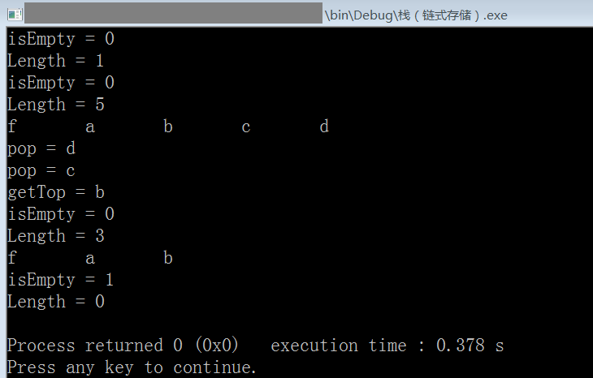

# 栈的链式存储结构（C 语言实现）

```c
#include <stdio.h>
#include <stdlib.h>

#define OK 1
#define ERR 2
#define TRUE 1
#define FALSE 0

typedef int status; //定义函数返回的状态，OK & ERR
typedef char datatype; //定义栈中每个元素的数据类型，这里暂定为字符型

typedef struct LinkStack_anon{
    datatype data; //数据区
    struct LinkStack_anon * next; //指针区
} LinkStack;

/* 函数原型，栈的基本操作 */
LinkStack *createLinkStack(datatype first_node_value);
status isEmpty(LinkStack *L);
void clear(LinkStack **L);
datatype getTop(LinkStack *L);
int getLength(LinkStack *L);
status push(LinkStack *L, datatype node_to_push);
datatype pop(LinkStack *L);
void showStack(LinkStack *L);

int main(){
    /* 测试 */
    LinkStack *root; //指向一个通过createLinkStack函数创建的栈
    root=createLinkStack('f');
    printf("isEmpty = %d\n",isEmpty(root));
    printf("Length = %d\n",getLength(root));
    push(root,'a');
    push(root,'b');
    push(root,'c');
    push(root,'d');
    printf("isEmpty = %d\n",isEmpty(root));
    printf("Length = %d\n",getLength(root));
    showStack(root);
    putchar('\n');
    printf("pop = %c\n",pop(root));
    printf("pop = %c\n",pop(root));
    printf("getTop = %c\n",getTop(root));
    printf("isEmpty = %d\n",isEmpty(root));
    printf("Length = %d\n",getLength(root));
    showStack(root);
    putchar('\n');
    clear(&root);
    printf("isEmpty = %d\n",isEmpty(root));
    printf("Length = %d\n",getLength(root));

    return 0;
}

LinkStack *createLinkStack(datatype first_node_value){
    LinkStack *tmp;
    tmp=malloc(sizeof(LinkStack)); //void*类型指针能自动转为其他类型的指针
    tmp->data=first_node_value; //初始化栈顶的数据区
    tmp->next=NULL; //初始化栈顶的指针区
    return tmp;
}
status isEmpty(LinkStack *L){
    if (L==NULL)
        return TRUE;
    else
        return FALSE;
}
void clear(LinkStack **L){
    //之所以形参的类型是双重指针，是因为这个函数需要修改传入的实参的值
    //函数clear的作用是将栈清空，这时实参应当指向NULL，所以需要在这个函数内修改实参的值
    if (isEmpty(*L)==FALSE){
        //不为空时才执行删除
        LinkStack * p,* q; //p始终指向当前要被删除的结点，而q始终指向要被删除的结点的下一个
        p=*L; //将p指向单链表的头结点，即栈的栈顶
        while (p!=NULL){
            //不是NULL就继续
            q=p->next; //q始终指向下一个结点
            free(p); //释放p所指的结点
            p=q; //交换
        }
        *L=NULL; //将指向栈的指针设为NULL
    }
}
datatype getTop(LinkStack *L){
    LinkStack * p=L;
    while (p && p->next!=NULL) //遍历到最后一个结点
        p=p->next;
    return p->data;
}
int getLength(LinkStack *L){
    int i=0;
    LinkStack * p=L;
    while (p){
        i++; p=p->next;
    }
    return i;
}
status push(LinkStack *L, datatype node_to_push){
    //node_to_insert表示想要入栈的元素
    //单链表中的尾插法
    LinkStack * s=malloc(sizeof(LinkStack)); //等待入栈的新结点
    LinkStack * p=L;
    s->data=node_to_push;
    s->next=NULL;
    while(p && p->next!=NULL) //找到栈的最后一个结点
        p=p->next;
    p->next=s;
    return OK;
}
datatype pop(LinkStack *L){
    //尾删法
    datatype s;
    LinkStack * p=L;
    if (isEmpty(L)) return ERR; //空栈
    while(p && p->next->next!=NULL) //找到栈的最后一个结点的前一个结点
        p=p->next;
    s=p->next->data; //先将最后一个结点的值保存
    free(p->next); //释放最后一个结点
    p->next=NULL;
    return s; //返回出栈的元素的值
}
void showStack(LinkStack *L){
    int i;
    int total=getLength(L);
    LinkStack * p=L;
    for (i=0; i<total; i++){
        printf("%c\t",p->data); p=p->next;
    }
}
/*
    栈的定义：仅限定在表尾进行插入和删除操作的线性表，即操作受限的线性表
    一般，把允许插入和删除的一端作为栈顶，另一端则是栈底
    不含任何元素的栈就是空栈
    所以，栈又称后进先出(Last in First out)的线性表
    对于链式存储的栈，不存在栈满的情况，除非已经没有可用的内存了，如果真的发生，那此时计算机就面临死机崩溃的地步了
*/
/* 环境: Code::Blocks with GCC 5.1 */
```

运行截图：



> 2020-01-22
