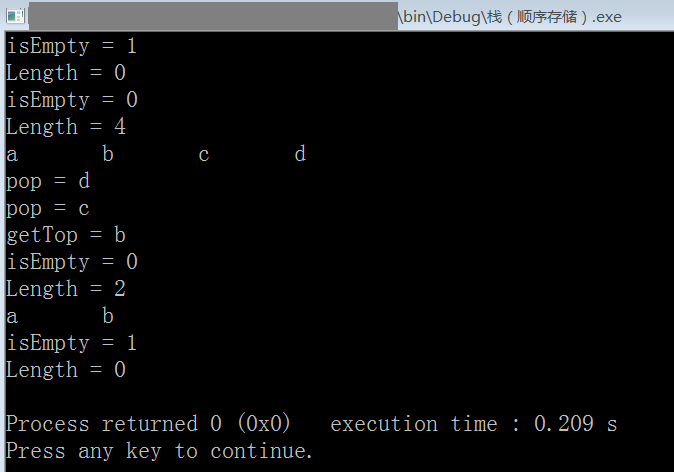

# 栈的顺序存储结构（C 语言实现）

```c
#include <stdio.h>
#include <stdlib.h>

#define OK 1
#define ERR 2
#define TRUE 1
#define FALSE 0
#define MAXSIZE 20 //定义栈的最大长度

typedef int status; //定义函数返回的状态，OK & ERR
typedef char datatype; //定义栈中每个元素的数据类型，这里暂定为字符型

typedef struct {
    datatype data[MAXSIZE]; //存储着栈中的每个元素
    int top; //用于标识栈顶，永远保存着栈顶元素的下标
} SequenceStack;

/* 函数原型，栈的基本操作 */
SequenceStack *createSequenceStack(void);
status isEmpty(SequenceStack *L);
void clear(SequenceStack *L);
datatype getTop(SequenceStack *L);
int getLength(SequenceStack *L);
status push(SequenceStack *L, datatype node_to_push);
datatype pop(SequenceStack *L);
void showStack(SequenceStack *L);

int main(){
    /* 测试 */
    SequenceStack *root; //指向一个通过createSequenceStack函数创建的栈
    root=createSequenceStack();
    printf("isEmpty = %d\n",isEmpty(root));
    printf("Length = %d\n",getLength(root));
    push(root,'a');
    push(root,'b');
    push(root,'c');
    push(root,'d');
    printf("isEmpty = %d\n",isEmpty(root));
    printf("Length = %d\n",getLength(root));
    showStack(root);
    putchar('\n');
    printf("pop = %c\n",pop(root));
    printf("pop = %c\n",pop(root));
    printf("getTop = %c\n",getTop(root));
    printf("isEmpty = %d\n",isEmpty(root));
    printf("Length = %d\n",getLength(root));
    showStack(root);
    putchar('\n');
    clear(root);
    printf("isEmpty = %d\n",isEmpty(root));
    printf("Length = %d\n",getLength(root));

    return 0;
}

SequenceStack *createSequenceStack(void){
    SequenceStack *tmp;
    tmp=malloc(sizeof(SequenceStack)); //void*类型指针能自动转为其他类型的指针
    tmp->top=-1;
    //初始化栈的栈顶指针，-1代表空栈，0表示只有一个元素的栈，那个元素就是数组下标0，依次类推
    return tmp;
}
status isEmpty(SequenceStack *L){
    if (L->top==-1)
        return TRUE;
    else
        return FALSE;
}
void clear(SequenceStack *L){
    L->top=-1;
}
datatype getTop(SequenceStack *L){
    return L->data[L->top];
}
int getLength(SequenceStack *L){
    return L->top+1;
}
status push(SequenceStack *L, datatype node_to_push){
    //node_to_insert表示想要入栈的元素
    if (L->top==MAXSIZE-1) return ERR; //满栈
    L->top++; //栈顶指针+1
    L->data[L->top]=node_to_push; //将新元素入栈
    return OK;
}
datatype pop(SequenceStack *L){
    datatype s;
    if (L->top==-1) return ERR; //空栈
    s=L->data[L->top]; //将要出栈的元素先赋值给临时变量s
    L->top--; //栈顶指针-1
    return s; //返回出栈的元素的值
}
void showStack(SequenceStack *L){
    int i;
    int total=getLength(L);
    for (i=0; i<total; i++){
        printf("%c\t",L->data[i]);
    }
}
/*
    栈的定义：仅限定在表尾进行插入和删除操作的线性表，即操作受限的线性表
    一般，把允许插入和删除的一端作为栈顶，另一端则是栈底
    不含任何元素的栈就是空栈
    所以，栈又称后进先出(Last in First out)的线性表
*/
/* 环境: Code::Blocks with GCC 5.1 */
```

运行截图：



> 2020-01-21
