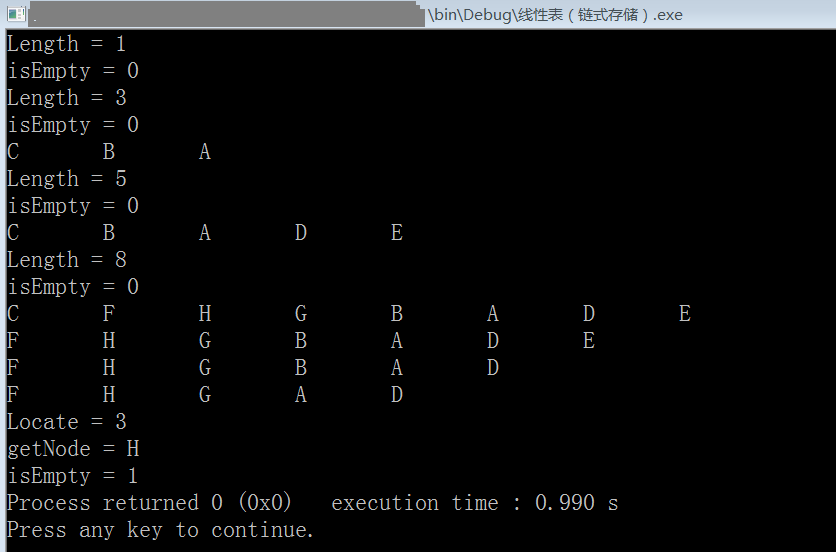

# 线性表的链式存储结构（C 语言实现）

```c
#include <stdio.h>
#include <stdlib.h>

#define OK 1
#define ERR 2
#define TRUE 1
#define FALSE 0

typedef int status; //定义函数返回的状态，OK & ERR
typedef char datatype; //定义线性表中每个结点的数据类型，这里暂定为字符型

typedef struct LinkList_anon{
    datatype data; //数据区
    struct LinkList_anon * next; //指针区
} LinkList;

/* 函数原型，线性表的基本操作 */
LinkList *createLinkList(datatype first_node_value);
status isEmpty(LinkList *L);
void clear(LinkList **L);
int getLength(LinkList *L);
int locateNode(LinkList *L,datatype node_to_locate);
datatype getNode(LinkList *L, int index);
status insert(LinkList **L, int index, datatype node_to_insert);
status delete(LinkList **L, int index);
void showList(LinkList *L);

int main(){
    /* 测试 */
    LinkList *root; //指向线性表
    root=createLinkList('A'); //创建一个线性表
    printf("Length = %d\n",getLength(root)); //打印线性表的当前长度
    printf("isEmpty = %d\n",isEmpty(root)); //打印线性表是否为空
    insert(&root,0,'B'); //头插法插入2个结点
    insert(&root,0,'C');
    printf("Length = %d\n",getLength(root));
    printf("isEmpty = %d\n",isEmpty(root));
    showList(root);
    putchar('\n');
    insert(&root,getLength(root),'D'); //尾插法插入2个结点
    insert(&root,getLength(root),'E'); //尾插法插入2个结点
    printf("Length = %d\n",getLength(root));
    printf("isEmpty = %d\n",isEmpty(root));
    showList(root);
    putchar('\n');
    insert(&root,1,'F'); //在index=1（第2个结点）插入新结点
    insert(&root,2,'G'); //在index=2（第3个结点）插入新节点
    insert(&root,2,'H'); //在index=2（第3个结点）插入新节点
    printf("Length = %d\n",getLength(root));
    printf("isEmpty = %d\n",isEmpty(root));
    showList(root); //打印线性表
    putchar('\n');
    delete(&root,0); //删除头结点
    showList(root);
    putchar('\n');
    delete(&root,getLength(root)-1); //删除尾结点
    showList(root);
    putchar('\n');
    delete(&root,3); //删除index=3（第4个）结点
    showList(root);
    putchar('\n');
    printf("Locate = %d\n",locateNode(root,'A')); //打印查找到的结点的位置
    printf("getNode = %c\n",getNode(root,1)); //打印下标是1的结点的值
    clear(&root); //清空线性表
    printf("isEmpty = %d",isEmpty(root));

    return 0;
}

LinkList *createLinkList(datatype first_node_value){
    LinkList *tmp;
    tmp=malloc(sizeof(LinkList));//void*类型指针能自动转为其他类型的指针
    tmp->data=first_node_value; //初始化头指针的数据区
    tmp->next=NULL; //初始化头结点的指针区
    return tmp;
}
status isEmpty(LinkList *L){
    if (L==NULL)
        return TRUE; //链表为空返回TRUE
    else
        return FALSE; //链表不为空返回FALSE
}
void clear(LinkList **L){
    if (isEmpty(*L)==FALSE){
        //不为空时才执行删除
        LinkList * p,* q; //p始终指向当前要被删除的结点，而q始终指向要被删除的结点的下一个
        p=*L; //将p指向线性表的头结点
        while (p!=NULL){
            //p不是NULL就继续循环
            q=p->next; //q始终指向下一个结点
            free(p); //释放p所指的结点
            p=q; //交换
        }
        *L=NULL; //将指向线性表的指针设为NULL
    }
}
int getLength(LinkList *L){
    int i=0;
    LinkList * p=L;
    if (isEmpty(L)==TRUE) return 0;
    while (p){
        i++;
        p=p->next;
    }
    return i;
}
int locateNode(LinkList *L, datatype node_to_locate){
    //返回找到的结点的index
    //node_to_locate应当是能唯一标识一个结点的数据，否则只返回匹配的第一个结点
    int i;
    int total=getLength(L);
    LinkList * p=L;
    for (i=0; i<total; i++){
        if (p->data==node_to_locate)
            return i;
        else
            p=p->next;
    }
    return -1; //未找到任何匹配
}
datatype getNode(LinkList *L, int index){
    //index表示线性表中第N个结点，头结点的index是0
    int i=0; //计数器
    LinkList * p=L; //临时结点，用于遍历
    if (isEmpty(L)==TRUE) return (datatype)ERR; //线性表为空
    while (p!=NULL && i<index){
        //p不是NULL且i还没等于index时，循环继续
        p=p->next;
        i++;
    }
    return p->data;
}
status insert(LinkList **L, int index, datatype node_to_insert){
    //node_to_insert表示想要插入的结点
    //当列表为空时，只有index=0才能插入
    //当index=0时，即头插，会修改传入的指针，将其指向新的头结点
    //当index=getLength(root)时，即尾插
    int k;
    LinkList * p;
    LinkList * tmp=malloc(sizeof(LinkList));
    if (index<0) return ERR; //index不在有效范围
    if (index==0){
        //头插
        tmp->next=*L; //将新结点的指针区指向链表的头结点，随之，新节点变成链表的头结点
        tmp->data=node_to_insert; //数据区
        *L=tmp; //将原来指向头结点的指针修改为现在的新头结点
        return OK;
    }
    if (index>getLength(*L)-1){
        //尾插
        tmp->next=NULL; //因为是尾插，此结点是链表的最后一个结点，所以指针区为NULL
        tmp->data=node_to_insert; //数据区
        p=*L; //变量p用于遍历
        while (p){
            //寻找当前线性表的最后一个结点，用于将新结点附在它的后面
            if (p->next==NULL)
                //找到了当前链表的最后一个
                break;
            p=p->next; //继续下一个结点
        }
        p->next=tmp; //将原来线性表的最后一个结点指向新的尾结点
        return OK;
    }
    //不是头插也不是尾插
    k=0;
    p=*L;
    for (k=0; k<index-1; k++){
        //遍历到第index个结点的前一个结点，头结点的index等于0
        //利用index的前一个结点的next就可以知道第index个结点
        p=p->next;
    }
    tmp->next=p->next; //把tmp接到index前面
    p->next=tmp; //再把tmp接到index前一个结点的后面
    tmp->data=node_to_insert; //数据区
    return OK;
}
status delete(LinkList **L, int index){
    //当index=0时，即头删
    //当index=getLength(root)-1时，即尾删
    int k;
    LinkList * p,* q;
    if (index<0) return ERR; //index不在有效范围
    if (index==0){
        //头删
        p=(*L)->next; //先将原来的头结点的下一个结点的指针保存起来
        free(*L); //释放原来的头结点
        *L=p; //将原来指向头结点的指针修改为现在的新头结点
        return OK;
    }
    if (index>getLength(*L)-2){
        //尾删
        p=*L; //变量p用于遍历
        while (p){
            //寻找当前线性表的最后一个结点的前一个结点，将这个结点的后一个结点（即最后一个结点）删除
            if (p->next->next==NULL)
                //找到
                break;
            p=p->next; //继续下一个结点
        }
        free(p->next); //将原来线性表的最后一个结点删除
        p->next=NULL; //将原来的倒数第二个结点变成尾结点
        return OK;
    }
    //不是头插也不是尾插
    p=*L;
    for (k=0; k<index-1; k++){
        //遍历到第index个结点的前一个结点，头结点的index等于0
        //利用index的前一个结点的next就可以知道第index个结点
        p=p->next;
    }
    q=p->next;
    p->next=p->next->next; //将index前一个结点和后一个结点相连
    free(q); //删除index的结点
    return OK;
}
void showList(LinkList *L){
    int i;
    int total=getLength(L);
    LinkList * p=L;
    for (i=0; i<total; i++){
        printf("%c\t",p->data); p=p->next;
    }
}

/*
    链式存储结构的线性表的优缺点：（注意，上述实现的链式线性表叫做单链表）
    优点：
        1.插入和删除的时间复杂度是0(1)
        2.存储空间不受预设限制
    缺点：
        1.寻找某个结点需要进行遍历操作
    另外，
        把单链表的尾结点的指针区指向头结点，便成为循环链表；
        把单链表的每个结点再增加一个指针区，新加的指针区指向前一个结点，便成为双向链表
*/
/* 环境: Code::Blocks with GCC 5.1 */
```

运行截图：



> 2020-01-19
