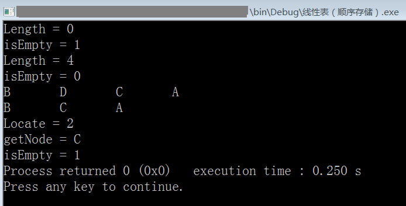

# 线性表的顺序存储结构（C 语言实现）

```c
#include <stdio.h>
#include <stdlib.h>

#define OK 1
#define ERR 2
#define TRUE 1
#define FALSE 0
#define MAXSIZE 20 //定义线性表的最大长度

typedef int status; //定义函数返回的状态，OK & ERR
typedef char datatype; //定义线性表中每个结点的数据类型，这里暂定为字符型

typedef struct {
    datatype data[MAXSIZE]; //存储着线性表中的每个结点
    int length; //线性表当前的长度
} SequenceList;

/* 函数原型，线性表的基本操作 */
SequenceList *createSequenceList(void);
status isEmpty(SequenceList *L);
void clear(SequenceList *L);
int getLength(SequenceList *L);
int locateNode(SequenceList *L,datatype node_to_locate);
datatype getNode(SequenceList *L, int index);
status insert(SequenceList *L, int index, datatype node_to_insert);
status delete(SequenceList *L, int index);
void showList(SequenceList *L);

int main(){
    /* 测试 */
    SequenceList *root; //指向线性表
    root=createSequenceList(); //创建一个线性表
    printf("Length = %d\n",getLength(root)); //打印线性表的当前长度
    printf("isEmpty = %d\n",isEmpty(root)); //打印线性表是否为空
    insert(root,0,'A'); //分别插入4个结点
    insert(root,0,'B');
    insert(root,1,'C');
    insert(root,1,'D');
    printf("Length = %d\n",getLength(root));
    printf("isEmpty = %d\n",isEmpty(root));
    showList(root); //打印线性表
    putchar('\n');
    delete(root,1); //删除index=1（数组下标为1）的结点
    showList(root);
    putchar('\n');
    printf("Locate = %d\n",locateNode(root,'A')); //打印查找到的结点的位置
    printf("getNode = %c\n",getNode(root,1)); //打印下标是1的结点的值
    clear(root); //清空线性表
    printf("isEmpty = %d",isEmpty(root));

    return 0;
}

SequenceList *createSequenceList(void){
    SequenceList *tmp;
    tmp=malloc(sizeof(SequenceList));//void*类型指针能自动转为其他类型的指针
    tmp->length=0; //初始化线性表长度
    return tmp;
}
status isEmpty(SequenceList *L){
    if (L->length==0)
        return TRUE;
    else
        return FALSE;
}
void clear(SequenceList *L){
    L->length=0;
}
int getLength(SequenceList *L){
    return L->length;
}
int locateNode(SequenceList *L, datatype node_to_locate){
    //返回找到的结点的index
    //node_to_locate应当是能唯一标识一个结点的数据，否则只返回匹配的第一个结点
    int i;
    for (i=0; i<L->length; i++){
        if (L->data[i]==node_to_locate)
            return i;
    }
    return -1; //未找到任何匹配
}
datatype getNode(SequenceList *L, int index){
    //index表示线性表中第N个结点，头结点的index是0
    if (L->length==0 || index<0 || index>L->length-1) return (datatype)ERR;
    return L->data[index];
}
status insert(SequenceList *L, int index, datatype node_to_insert){
    //node_to_insert表示想要插入的结点
    //当列表为空时，只有index=0才能插入
    int k;
    if (L->length == MAXSIZE) return ERR; //线性表已满
    if (index<0 || index>L->length) return ERR; //index不在有效范围
    if (index<L->length){
        //插入的位置不是最后一个结点的下一个结点
        for (k=L->length-1; k>=index; k--){
            L->data[k+1]=L->data[k]; //将要插入结点后面的所有结点都往后移
        }
    }
    L->data[index]=node_to_insert; //将新结点插入
    L->length++;
    return OK;
}
status delete(SequenceList *L, int index){
    int k;
    if (L->length == 0) return ERR; //线性表为空
    if (index<0 || index>L->length-1) return ERR; //index不在有效范围
    if (index<L->length-1){
        //删除的位置不是最后一个结点
        for (k=index; k<L->length-1; k++){
                L->data[k]=L->data[k+1]; //将删除位置后面的结点都往前移
        }
    }
    L->length--;
    return OK;
}
void showList(SequenceList *L){
    int i;
    for (i=0; i<L->length; i++){
        printf("%c\t",L->data[i]);
    }
}

/*
    顺序存储结构的线性表的优缺点：
    优点：
        1.不必为每个结点之间的逻辑关系增加额外的存储空间
        2.可以快速地读和写表中任意一个结点
    缺点：
        1.插入和删除需要移动大量结点
        2.线性表动态变化较大，难以确定所需的存储空间
        3.数组预设过长会造成空间浪费（存储碎片）
*/
/* 环境: Code::Blocks with GCC 5.1 */
```

运行截图：



> 2020-01-18 18:34
