# 分析 FAT32 内部结构 -入门篇-

FAT32(File Allocation Table)是一种 32 位的 FAT 文件系统，微软在 1996 年 8 月发布。

FAT32 的数字 32 是下面会讲到的 FAT 中每个表项的长度。

磁盘（硬盘）是数据的载体，而文件系统则是将这些数据以某种合理的结构组织起来方便操作系统的管理。

借此文分析一下微软的 FAT32 文件系统格式：（本文分析的 FAT32 分区是 D 盘，大小为 128MB！环境为 VMware 虚拟机下的 XP 系统！）

FAT32 由 4 个部分组成，分别是 DBR,FAT1,FAT2 和 DATA，如图：

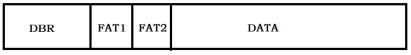

DBR：该分区的引导程序，在 DBR 的结尾部分会有一些重要的保留扇区（这些保留扇区属于 DBR，图中未画出）

FAT1：FAT 的首要文件分配表

FAT2：文件分配表的备份

DATA：数据区（最小单位为簇(cluster)，一般 2 个扇区为 1 簇，是微软规定的一种磁盘存储单位，与 Linux 的 block 概念类似）

FAT32 的 DBR 结构图：

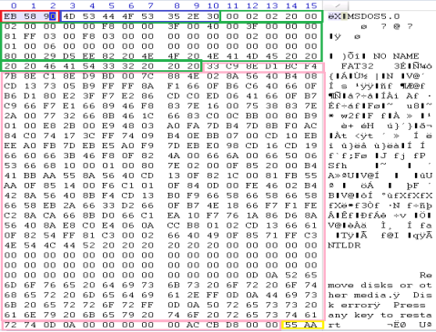

红色：跳转指令，将当前执行流程跳转到引导程序处，占 2 字节，对应汇编 JUMP 58H; NOP;

蓝色：OEM 代号，由创建该文件系统的厂商规定，占 8 字节，一般为”MSDOS5.0”

绿色：BPB(BIOS Paramter Block)，从 DBR 的第 12 个字节开始共占用 79 字节，记录了文件系统的重要信息，相关字段参数见下表

粉红色：DBR 引导程序，如果该分区没安装操作系统那么这段程序是没用的

黄色：DBR 结束标记

<table cellspacing="0">
<tbody>
<tr>
<td colspan="3" valign="top" width="568">

BPB表：

</td>
</tr>
<tr>
<td valign="top" width="49">

偏移

</td>
<td valign="top" width="32">

字节

</td>
<td valign="top" width="486">

含义

</td>
</tr>
<tr>
<td valign="top" width="49">

BH

</td>
<td valign="top" width="32">

2

</td>
<td valign="top" width="486">

每扇区的字节个数

</td>
</tr>
<tr>
<td valign="top" width="49">

DH

</td>
<td valign="top" width="32">

1

</td>
<td valign="top" width="486">

每簇扇区数

</td>
</tr>
<tr>
<td valign="top" width="49">

EH

</td>
<td valign="top" width="32">

2

</td>
<td valign="top" width="486">

保留的扇区个数

</td>
</tr>
<tr>
<td valign="top" width="49">

10H

</td>
<td valign="top" width="32">

1

</td>
<td valign="top" width="486">

FAT个数

</td>
</tr>
<tr>
<td valign="top" width="49">

11H

</td>
<td valign="top" width="32">

2

</td>
<td valign="top" width="486">

不使用（根目录数量，FAT32已突破此限制，已无效，一般为0）

</td>
</tr>
<tr>
<td valign="top" width="49">

13H

</td>
<td valign="top" width="32">

2

</td>
<td valign="top" width="486">

不使用（扇区总数，小于32M时才使用）

</td>
</tr>
<tr>
<td valign="top" width="49">

15H

</td>
<td valign="top" width="32">

1

</td>
<td valign="top" width="486">

存储介质描述符

</td>
</tr>
<tr>
<td valign="top" width="49">

16H

</td>
<td valign="top" width="32">

2

</td>
<td valign="top" width="486">

不使用（FAT占的扇区数，小于32M时才使用）

</td>
</tr>
<tr>
<td valign="top" width="49">

18H

</td>
<td valign="top" width="32">

2

</td>
<td valign="top" width="486">

每磁道扇区个数

</td>
</tr>
<tr>
<td valign="top" width="49">

1AH

</td>
<td valign="top" width="32">

2

</td>
<td valign="top" width="486">

磁头数

</td>
</tr>
<tr>
<td valign="top" width="49">

1CH

</td>
<td valign="top" width="32">

4

</td>
<td valign="top" width="486">

隐藏扇区

</td>
</tr>
<tr>
<td valign="top" width="49">

20H

</td>
<td valign="top" width="32">

4

</td>
<td valign="top" width="486">

扇区总数（大于32M时使用）

</td>
</tr>
<tr>
<td valign="top" width="49">

24H

</td>
<td valign="top" width="32">

4

</td>
<td valign="top" width="486">

FAT占的扇区数（大于32M时使用）

</td>
</tr>
<tr>
<td valign="top" width="49">

28H

</td>
<td valign="top" width="32">

2

</td>
<td valign="top" width="486">

扩展标记

</td>
</tr>
<tr>
<td valign="top" width="49">

2AH

</td>
<td valign="top" width="32">

2

</td>
<td valign="top" width="486">

版本，一般为0

</td>
</tr>
<tr>
<td valign="top" width="49">

2CH

</td>
<td valign="top" width="32">

4

</td>
<td valign="top" width="486">

根目录的首簇号

</td>
</tr>
<tr>
<td valign="top" width="49">

30H

</td>
<td valign="top" width="32">

2

</td>
<td valign="top" width="486">

文件系统整体信息扇区号

</td>
</tr>
<tr>
<td valign="top" width="49">

32H

</td>
<td valign="top" width="32">

2

</td>
<td valign="top" width="486">

DBR备份所在的扇区号

</td>
</tr>
<tr>
<td valign="top" width="49">

34H

</td>
<td valign="top" width="32">

12

</td>
<td valign="top" width="486">

保留，固定为0

</td>
</tr>
<tr>
<td valign="top" width="49">

40H

</td>
<td valign="top" width="32">

1

</td>
<td valign="top" width="486">

BIOS驱动器号

</td>
</tr>
<tr>
<td valign="top" width="49">

41H

</td>
<td valign="top" width="32">

1

</td>
<td valign="top" width="486">

不使用，一般为0

</td>
</tr>
<tr>
<td valign="top" width="49">

42H

</td>
<td valign="top" width="32">

1

</td>
<td valign="top" width="486">

扩展引导标记

</td>
</tr>
<tr>
<td valign="top" width="49">

43H

</td>
<td valign="top" width="32">

4

</td>
<td valign="top" width="486">

卷序列号

</td>
</tr>
<tr>
<td valign="top" width="49">

47H

</td>
<td valign="top" width="32">

11

</td>
<td valign="top" width="486">

卷标

</td>
</tr>
<tr>
<td valign="top" width="49">

52H

</td>
<td valign="top" width="32">

8

</td>
<td valign="top" width="486">

文件系统类型名，固定为”FAT32 &nbsp;&nbsp;”

</td>
</tr>
</tbody>
</table>

FAT32 文件系统在 DBR 的保留扇区中有一个文件系统信息扇区，用以记录数据区中空闲簇的数量及下一个空闲簇的簇号，该扇区一般在分区的 LAB1 扇区，也就是紧跟着 DBR 后的一个扇区，其内如下：

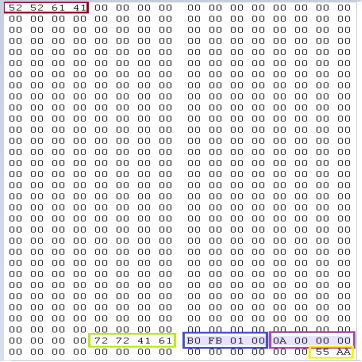

褐色：扩展引导标签，为 52 52 61 41，ASCII 为”RRaA”

青色：文件系统信息签名，为 72 72 41 61，ASCII 为”rrAa”

蓝色：空闲簇的数量，(1FBB0)=129968，每个簇 1K，约等于 127MB，即 D 盘的大小

紫色：下一个空闲簇的簇号

黄色：结束标记

其他字节：不使用，填充 0

由于 FAT 紧跟在 DBR 的保留扇区之后，所以定位到最后一个保留扇区，那么下一个扇区就是 FAT 啦！

在上面的 DBR 图中可以找到保留扇区的个数为 20H=32（20 00 是小端表示法），所以 DBR 往后 32 个扇区就是首要 FAT 啦，如图：

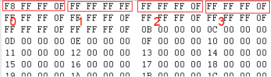

FAT 以 4 字节（32 位）为一个表项，每个表项值的含义：

<table cellspacing="0">
<tbody>
<tr>
<td valign="top" width="284">

0x0000 0000

</td>
<td valign="top" width="284">

空闲簇，可用簇

</td>
</tr>
<tr>
<td valign="top" width="284">

0x0000 0001

</td>
<td valign="top" width="284">

保留簇

</td>
</tr>
<tr>
<td valign="top" width="284">

0x0000 0002 ~ 0x0FFF FFEF

</td>
<td valign="top" width="284">

该簇已用，其值指向下一个簇号

</td>
</tr>
<tr>
<td valign="top" width="284">

0x0FFF FFF0 ~ 0X0FFF FFF6

</td>
<td valign="top" width="284">

这些值保留，不使用

</td>
</tr>
<tr>
<td valign="top" width="284">

0x0FFF FFF7

</td>
<td valign="top" width="284">

坏簇，当一个簇中有一个扇区损坏（如物理损坏、病毒感染）时称为坏簇，这个簇将不被FAT32使用

</td>
</tr>
<tr>
<td valign="top" width="284">

0x0FFF FFF8 ~ 0x0FFF FFFF

</td>
<td valign="top" width="284">

文件的最后一个簇

</td>
</tr>
</tbody>
</table>

每个表项的值对应了相应簇的使用情况，如 2 号表项对应了 2 号簇的使用情况，3 号表项对应了 3 号簇的使用情况，注意的是，最开头的两个表项是不使用的，它们代表 FAT 的表头，其值是固定的 0xFFF FFF8 和 0xFFFF FFFF，所以！FAT32 中不存在 0 号簇和 1 号簇，第 1 个簇是 2 号簇！画张图：

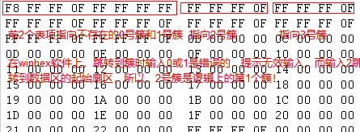

如果该簇是文件的最后一簇，填入的值为 0x0FFFFFFF，如果该簇不是文件的最后一簇，则填入的值为该文件占用的下一簇号（所以可以看出在 FAT32 文件系统中文件是以簇链表的形式保存起来的）。

2 号表项存储的是 2 号簇的使用情况，一般 2 号簇（也就是文件系统的第 1 个簇）存储的是文件系统的根目录，虽然在 FAT32 中，根目录的位置不再硬性固定，可以存储在分区内可寻址的任意簇内，不过通常根目录是最早建立的（格式化时）目录，所以基本上都是根目录首簇紧邻 FAT2，占簇区顺序上的第 1 个簇（即 2 号簇），同时，FAT32 将根目录当做普通的数据文件，所有没有了目录个数的限制，在需要的时候可以分配空簇。这一项（2 号表项）的值为 0x0FFFFFFF ，说明当前根目录占了 1 个簇的大小。

现在来分析数据区，数据区是紧接在 FAT2 之后的，所以在 DBR 往后（保留扇区+FAT1 占用的扇区+FAT2 占用的扇区）个扇区就是数据区啦，如图（这是数据区的第一个扇区，也是第一个簇的前半部分）：

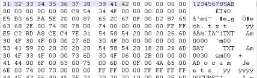

发现前 11 字节是我们的卷标！

而在 BPB 中卷标那项的值永远是”NO NAME ”，也就是说卷标被移动到了数据区的前 11 字节，而且 FAT32 卷标最长 11 字节（因为 BPB 中已经规定了），而 NTFS 已经突破了这个限制。

其实，卷标是根目录下的第一个文件！

现在来分析一下 FAT32 下文件和目录之间是如何组织的，如何存储的，如何保存属性的：

先低级格式化 D 盘，以确保分区干净（指的是数据区全填充为 0），

低级格式化完成（如果分区较大，低格的速度会变慢，耐心等待）之后，查看一个首要 FAT 表，

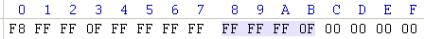

有一个表项，它的值为 FFF FFFFH，意思就是结束簇，这就是我们的根目录啦，再查看一个根目录所在的起始簇，
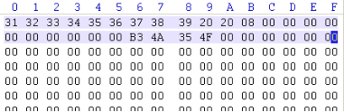

发现前两行（32 字节）有数据，后面全是 0，然后我们在 D 盘（根目录）下粘贴一个空文件（在其他盘（如 C 盘）新建一个文本文件，然后复制到 D 盘，下面会讲为什么不能直接在 D 盘新建文件，而非要从其他盘复制），

再去首要 FAT 中查看变化，发现没有变化，看起来新建的文件不占表项，再去根目录所在簇查看一下，

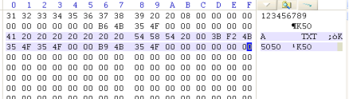

发现！多了 2 行（32 字节），这就是我们刚刚新建（其实是粘贴）的空文件 A.TXT 啦，现在我们要引入一个 FAT32 下短文件目录项概念了，来个表格，

<table cellspacing="0">
<tbody>
<tr>
<td valign="top" width="83">

字节偏移

</td>
<td colspan="2" valign="top" width="68">

字节数

</td>
<td valign="top" width="261">

说明

</td>
</tr>
<tr>
<td valign="top" width="83">

0H

</td>
<td colspan="2" valign="top" width="68">

8

</td>
<td valign="top" width="261">

文件名

</td>
</tr>
<tr>
<td valign="top" width="83">

8H

</td>
<td colspan="2" valign="top" width="68">

3

</td>
<td valign="top" width="261">

后缀名，扩展名，类型名

</td>
</tr>
<tr>
<td rowspan="7" valign="top" width="83">

BH

</td>
<td rowspan="7" valign="top" width="34">

1

</td>
<td rowspan="7" valign="top" width="34">

文件属性

</td>
<td valign="top" width="261">

0000 0000B, 0H 读写

</td>
</tr>
<tr>
<td valign="top" width="261">

0000 0001B, 1H 只读

</td>
</tr>
<tr>
<td valign="top" width="261">

0000 0010B, 2H 隐藏

</td>
</tr>
<tr>
<td valign="top" width="261">

0000 0100B, 4H 系统

</td>
</tr>
<tr>
<td valign="top" width="261">

0000 1000B, 8H 卷标

</td>
</tr>
<tr>
<td valign="top" width="261">

0001 0000B, 10H 子目录

</td>
</tr>
<tr>
<td valign="top" width="261">

0010 0000B, 20H 归档

</td>
</tr>
<tr>
<td valign="top" width="83">

CH

</td>
<td colspan="2" valign="top" width="68">

1

</td>
<td valign="top" width="261">

保留

</td>
</tr>
<tr>
<td valign="top" width="83">

DH

</td>
<td colspan="2" valign="top" width="68">

1

</td>
<td valign="top" width="261">

创建时间的10毫秒位

</td>
</tr>
<tr>
<td valign="top" width="83">

EH

</td>
<td colspan="2" valign="top" width="68">

2

</td>
<td valign="top" width="261">

创建时间

</td>
</tr>
<tr>
<td valign="top" width="83">

10H

</td>
<td colspan="2" valign="top" width="68">

2

</td>
<td valign="top" width="261">

创建日期

</td>
</tr>
<tr>
<td valign="top" width="83">

12H

</td>
<td colspan="2" valign="top" width="68">

2

</td>
<td valign="top" width="261">

最后一次访问的日期

</td>
</tr>
<tr>
<td valign="top" width="83">

14H

</td>
<td colspan="2" valign="top" width="68">

2

</td>
<td valign="top" width="261">

起始簇号的高16位

</td>
</tr>
<tr>
<td valign="top" width="83">

16H

</td>
<td colspan="2" valign="top" width="68">

2

</td>
<td valign="top" width="261">

最近一次修改的时间

</td>
</tr>
<tr>
<td valign="top" width="83">

18H

</td>
<td colspan="2" valign="top" width="68">

2

</td>
<td valign="top" width="261">

最近一次修改的日期

</td>
</tr>
<tr>
<td valign="top" width="83">

1AH

</td>
<td colspan="2" valign="top" width="68">

2

</td>
<td valign="top" width="261">

起始簇号的低16位

</td>
</tr>
<tr>
<td valign="top" width="83">

1CH

</td>
<td colspan="2" valign="top" width="68">

4

</td>
<td valign="top" width="261">

文件长度

</td>
</tr>
</tbody>
</table>

可以看出文件长度为 0，起始簇号高 16 位为 0H，低 16 位也为 0H，也就是指向 0 号簇，但是 0 号簇不存在，所以此文件不存在起始簇，也就验证了文件长度为 0，现在我们用记事本打开此文件，向其中写几个单词，

再来看看此文件的属性，

现在先去看一下首要 FAT 的变化，

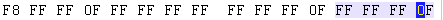

哈哈，多了一个表项哦，这个多的表项的值也是 FFF FFFFH，也就是结束簇，我们再去根目录所在簇看看，

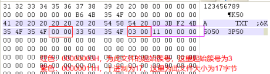

发现了没，起始簇号和文件长度都发现了相应的变化，图中给出了计算值，这符合前面用右键查看的 A.TXT 属性，且起始簇号为 3 也是正确的，因为簇号 2 被根目录所占用，那么下一个簇号就是 3 啦，现在我们去簇号 3 看看，

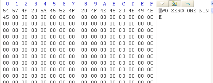

现在我们将 A.TXT 增加到几 KB（我从网上找了微软的百度百科复制了其中一段），这里需要注意，因为我这个 D 盘的簇大小仅仅为 1KB，所以大于 1KB 就可以完成本步骤的实验了，如果你们的簇大小为 NKB，那么 A.TXT 需要大于 NKB 才行，

然后我们先去根目录查看一下，

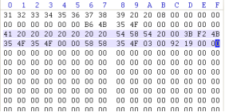

数值又发生了变化，但是一定和上图的属性中一样，这里不再计算，然后我们再去首要 FAT 看一下，

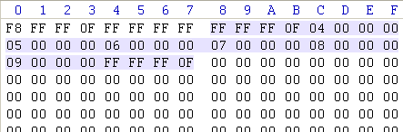

发现，多了 6 项，且原来的 3 号表项已经不是 FFF FFFFH 了，取而代之的是 9 号表项变成了 FFF FFFFH，这样就形成了簇链，文件系统读取时就通过这个单链表读取，我们简单计算一下，A.TXT 最多占 7 个簇（第 7 个簇恰好全部用完，即占用空间的大小），最少占 6 个簇（第 7 个簇只用了 1 个字节），那么推测出 A.TXT 大小在[6144+1,7168]字节，而 A.TXT 在其的属性截图中大小为 6546 字节，占用空间为 7168 字节，完全符合，

现在我们来看一下 FAT32 的长文件目录项格式（现在基本用的都是长文件名啦），

<table cellspacing="0">
<tbody>
<tr>
<td valign="top" width="72">

字节偏移

</td>
<td valign="top" width="62">

字节数

</td>
<td valign="top" width="432">

说明

</td>
</tr>
<tr>
<td rowspan="4" valign="top" width="72">

0H

</td>
<td rowspan="4" valign="top" width="62">

1

</td>
<td valign="top" width="432">

第7位：保留

</td>
</tr>
<tr>
<td valign="top" width="432">

第6位：1表示长文件最后一个目录项

</td>
</tr>
<tr>
<td valign="top" width="432">

第5位：保留

</td>
</tr>
<tr>
<td valign="top" width="432">

第0~4位：顺序号

</td>
</tr>
<tr>
<td valign="top" width="72">

1H

</td>
<td valign="top" width="62">

10

</td>
<td valign="top" width="432">

Unicode文件名第1部分

</td>
</tr>
<tr>
<td valign="top" width="72">

BH

</td>
<td valign="top" width="62">

1

</td>
<td valign="top" width="432">

长文件名目录项标志，值默认FH

</td>
</tr>
<tr>
<td valign="top" width="72">

CH

</td>
<td valign="top" width="62">

1

</td>
<td valign="top" width="432">

保留

</td>
</tr>
<tr>
<td valign="top" width="72">

DH

</td>
<td valign="top" width="62">

1

</td>
<td valign="top" width="432">

校验值（根据短文件名计算）

</td>
</tr>
<tr>
<td valign="top" width="72">

EH

</td>
<td valign="top" width="62">

12

</td>
<td valign="top" width="432">

Unicode文件名第2部分

</td>
</tr>
<tr>
<td valign="top" width="72">

1AH

</td>
<td valign="top" width="62">

2

</td>
<td valign="top" width="432">

起始簇号

</td>
</tr>
<tr>
<td valign="top" width="72">

1CH

</td>
<td valign="top" width="62">

4

</td>
<td valign="top" width="432">

Unicode文件名第3部分

</td>
</tr>
</tbody>
</table>

我们再从其他盘复制过来一个长文件名的空文本文件，

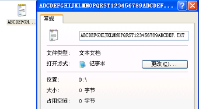

查看一下根目录，

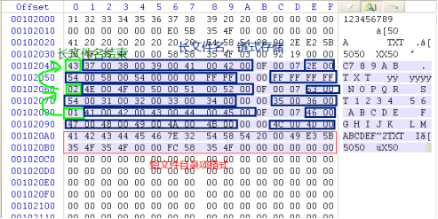

长文件名是以链表方式存储的，所以能存很长很长的文件名，文件名结束符为’\0’，即 0H，如果结束符之后还有剩余的 Unicode 字符则以 FFH 填充，在长文件目录项的最后两行是它的短目录项存储格式哦，简单说一下为什么长文件目录项第 1 行第 1 字节为 43H，下图，

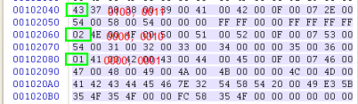

至此，简单的 FAT32 组织结构已经介绍完了，欢迎读者深入探究。

附上，一篇写 FAT32 不错的博文：https://blog.csdn.net/yangyang031213/article/details/79030247

来说一下为什么上面要复制其他盘的文件到 D 盘，因为直接在 D 盘新建一个文本文件是“新建 文本文档.txt”，然后我们将它重名名为“NEW.TXT”，然后在 winhex 查看，发现还是存在一个“新建 文本文档.txt”的，只不过是删除状态的，所以为了避免这项因素的干扰，我就选择了从其他盘复制文件过来。

附上簇的取值范围表：

<table cellspacing="0">
<tbody>
<tr>
<td valign="top" width="91">

分区大小

</td>
<td valign="top" width="239">

FAT32默认簇大小

</td>
</tr>
<tr>
<td valign="top" width="91">

32~256M

</td>
<td valign="top" width="239">

中间还分多个挡位：512B,1K,2K

</td>
</tr>
<tr>
<td valign="top" width="91">

257M~8G

</td>
<td valign="top" width="239">

4K

</td>
</tr>
<tr>
<td valign="top" width="91">

8G~16G

</td>
<td valign="top" width="239">

8K

</td>
</tr>
<tr>
<td valign="top" width="91">

32G~2T

</td>
<td valign="top" width="239">

32K

</td>
</tr>
</tbody>
</table>

题外话，也算是一个练习，验证网上说的“FAT32 最大只能存放 4G 的文件”：

因为 FAT32 中目录项中每个文件的文件长度是 4 字节，4 字节最大能寻址的字节数为 2 的 32 次，换算为 G 就是 4G 啦，即 `2^32B/1024^3=4G`。

> 2019-09-21
