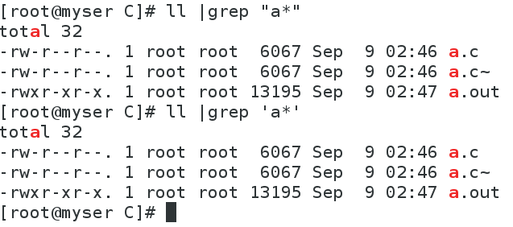

# 分享一下今天遇到的两个问题，一个是关于 C 语言内存泄漏问题，另一个是关于 Linux 下 grep 使用时的问题

## C 语言内存泄漏问题：

给出如下代码：

```c
#include <stdio.h>
#include <stdlib.h>
int main(){
    int *p;
    p=(int*)malloc(4);
    p[0]=12; //等于*p=12
    p[1]=13; //等于*(p+1)=13
    printf("%d\n",p[0]);
    printf("%d\n",p[1]);
    free(p);
    return 0;
}
```

上述代码在 VC++6.0 下运行报错，错误截图如下：


原因是，我只申请了 4 字节的内存空间，但是却放了 2 个 int（4 字节）的数据，所以 free 的时候出现错误，但是！在 GCC 下编译却能运行，很奇怪（此问题待解决，如果懂的朋友可以在本文下方留言，欢迎讨论和学习）。（GCC 是 Win10 下的 CodeBlocks 自带的 MinGW 的 GCC5.1.0 和 RHEL7 下的 GCC4.8.2）

## Linux 的 grep 问题：

给出如下 shell 代码：

```bash
ll | grep a*
```

当前目录下有三个文件，分别为：a.c, a.c~, a.out。

而此 shell 运行的结果为：


为什么结果不是输出所有以 a 开头的文件呢，而输出了"Binary file a.out matches"？

我们先来复习一下管道符的作用，它将前一个命令的**标准输出**重定向到后一个命令的**标准输入**，所以，如果一个命令不支持接收标准输入，那么使用管道符就没意义了。

我们还需要知道 grep 的基本用法，即 grep string_to_search file1 file2 file3...

再来看一下 grep 命令的手册，其中在 DESCRIPTION 有这样一段话（粉色框）：


大概的意思是说，grep 会在给出的文件中或者标准输入中寻找要匹配的字符串，也就是说文件或者标准输入二选一，那么如果文件和标准输入同时给出会怎么样呢，我们试验一下：在 abc 目录下有两个文件，名为 myFile1 和 myFile2，其中 myFile1 内容是一行"hello"，myFile2 内容是一行"OKmy"，然后是三个命令以及它们的运行结果（下图）


分析一下这三条命令：

1."grep my myFile1 myFile2"：在给出的文件（myFile1 和 myFile2）中搜索字符串"my"

2."ls | grep my"：在来自 ls 的标准输出中搜索字符串"my"

3."ls | grep my myFile1 myFile2"：在这条 grep 中，我们**同时**给出了文件和标准输入（来自 ls 的标准输出），发现它运行的结果和第一条一样，所以我们可以看出，如果对 grep 同时给出文件和标准输入，那么它**只在文件中搜索，而忽略标准输入**！

现在，我们再来看一下最初的问题，直接在终端上写的\*是一种通配符，它会自动进行文件名扩展（这里推荐《学习 bash：第二版》，第一章将各种扩展讲得很详细），所以上述代码"ll |grep a\*"经过扩展之后就是"ll |grep a.c a.c~ a.out"了，再来看看扩展后的代码是在干嘛，扩展后的代码将 ll 的输出通过管道符重定向到 grep 命令的输入，但是，由于 grep 已经给出了搜索的文件（a.c~和 a.out），所以这个标准输入被忽略，所以这个扩展后的代码是在做：从 a.c~和 a.out 文件中搜索字符串"a.c"！！！！而 a.out 是一个程序，是一个二进制文件，当 grep 在二进制文件搜索文本时会提示"Binary file a.out matches"！

解决方法，使用双引号或单引号来抑制文件名扩展（使\*的通配符功能消失，变成普通的字符，而这个普通的\*会被 grep 当作正则表达式的元字符——重复前一个字符 0 或多次！）：


对上面粉色框中的文字更准确的理解：
grep 会在给出的文件中搜索将要匹配的字符串，如果没有给出任何文件，那么将从标准输入中搜索，如下面的代码，只给出了要匹配的字符串"my"而没有给出文件，所以 grep 将在标准输入中搜索（按下^D 结束标准输入流，也就结束了 grep 命令）：


> 2019-09-09
