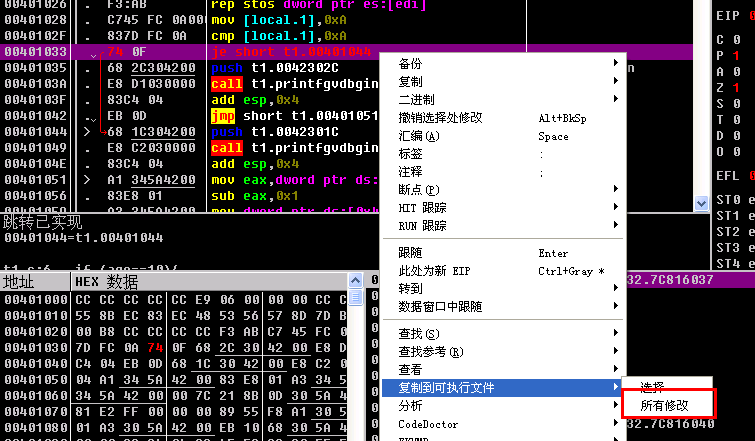

# 利用 OD 破解一个简单的 C 语言程序

最近在学习汇编（看的是王爽老师的《汇编语言(第三版)》），然后想尝试使用 OD(Ollydbg)软件破解一个简单的 C 语言程序练练手。

环境：

C 语言编译环境：VC++6.0

系统：在 Windows10 下开的 VM 虚拟机中的 Windows XP

C 语言程序代码：

```c
#include <STDIO.H>

int main(){
    int age;
    age=10;
    if (age==10){
        printf("Successful\n");
    }else{
        printf("No Access\n");
    }
    getchar();

    return 0;
}
```

这个程序编译后，正常运行输出的是"Successful"，而现在的目的是采用反汇编让该程序输出"NO Access"。

我们先在 VC6 中分析一下这个程序反汇编(Disassembly)之后的结果：（这个步骤不会请自行百度）


简单分析之后，可以看出"if (age==10)"被编译为：

CMP DWORD PTR [EBP-4],0AH

JNE main+34H

分析一下这两条汇编指令：

CMP 用于将 SS:[EBP-4]内存单元中（这个内存单元保存的就是变量 age 的值）数据与 0AH 做减法运算，但是不保存结果，只影响标志位，由于被减数和减数都是 0AH，所以相减为 0，标志位 ZF=1。

JNE 全称为 Jump if Not Equal，它与 JNZ(Jump if Not Zero)指令等价（为什么要说到 JNZ 呢，因为在 OD 软件中是 JNZ 而不是 JNE），JNE/JNZ 判断标志位 ZF 是否为 1，如果为 1 则不跳转，显然此时的 ZF=1，那就是不跳转了，将继续执行下面的指令，就输出了"Successful"了。

而我们需要输出"No Access"，就需要让它跳转，那怎么让它跳转呢，很简单，只需要将 JNE 修改为 JE 就行了，JE 就是如果 ZF=1 则跳转。

知道了突破口，用 OD 打开这个程序，找到 00401033H 行（由于编译环境不同，读者可能不是此行，建议使用 ASCII 字符串搜索"Successful"进行跳转，此方法自行百度）。


双击选中的行，将 jnz 改写为 jz，然后单击“汇编”按钮即可。


在修改的行右键，选择“复制到可执行文件”->“所有修改”，在跳出的对话框中选择“全部复制”。



在跳出的新窗口中右键选择“保存文件”即可保存修改之后的程序。


然后运行修改之后的程序，显示的就是"No Access"啦！


> 2019-08-31
