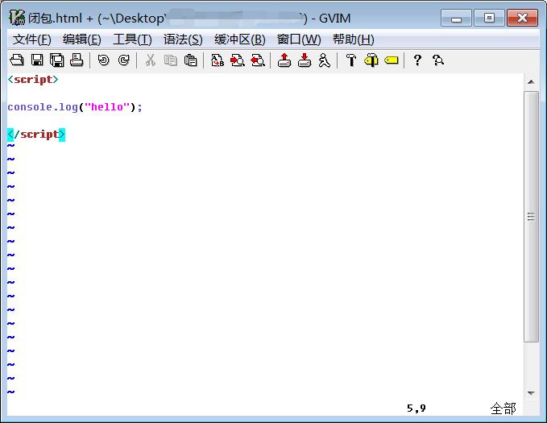

# gVim 设置默认主题和字体（图文详细版）

对于平时主力生产环境是 Windows 的学生党来说，可以通过 gVim（Vim-gnome，是 Vim 的跨平台图形化版本）来学习 Vim 是很不错的一个选择，因为 Vim 有很多记忆性的命令，如果一段时间不使用 Vim，一旦再次回到 Linux 操作 Vim，就会很陌生。

默认的 gVim 配色是亮白色，字号也较小，如下，

在设置主题之前，我们需要先知道有哪些主题，有两种方式查看，

第一种：通过 gVim 菜单的【编辑】->【配色方案】查看，如果你直接选择，那么这个主题只对当前的 gVim 实例生效，重启 gVim 之后依旧是亮白色的主题，这个和直接在末行模式输入":colorscheme themeName"相同，如果只是输入":colorscheme"则显示当前的主题/配色方案。

第二种：去 gVim 安装目录，进入【Vim】->【vim80】->【colors】，其中【vim80】的 80 表示当前 gVim 的版本，这里可以看出我的版本是 8.0，在【colors】目录下又很多.vim 类型的文件，这些都是 gVim 的主题文件。

我们根据上面任意一种方法选择一个自己喜欢的主题，然后打开 gVim 的配置文件（在 Linux 下，Vim 的用户配置文件是~/.vimrc，而在 Windows 下，gVim 的配置文件是其安装目录下的\_vimrc），如下图，

我们使用记事本或其他编辑器（如 Notepad++）打开这个文件，在下图中的位置添加指令，

在上图中，我选择了"evening"这款夜间主题，然后保存这个文件，重启 gVim，可以看见默认的主题已经改变，如下图，

这时在末行模式输入":colorscheme"，显示"evening"，说明当前主题是夜间主题，现在我们再来设置默认字体和字号，类似的，我们可以先查看一下现在有哪些字体，也有两种方法，

1.gVim 中的菜单栏中的【编辑】->【选择字体】，可以看到当前系统已经安装的字体，也可以设置字号和字样（常规、粗体、斜体、粗斜体），同时也能看到当前默认的字体（下图中蓝色选择的"Fixedsys"就是当前默认字体，另外一种查看当前字体的方法是在末行模式输入"set guifont"），如果在这里设置字体，依旧只对当前这个 gVim 实例生效，不是永久的。

2.去 Windows 的控制面板中搜索"字体"，查看系统已经安装的全部字体。

现在开始设置我们默认的字体和字号，由于不同版本或者不同平台的 Vim 对字体设置的选项存在些许差异（在网络上，我已经看到了很多不同设置字体的命令），所以，我们需要找到一个对当前 gVim 能识别的格式，所以我们再次回到【编辑】->【选择字体】，然后我们选择适合自己的字体和字号，然后确定，回到 gVim 窗口，在末行模式输入"set guifont"查看当前的字体配置，如下图，

可以看出我刚刚选择的字体名是 Consolas，字号是 15，字体编码是 ANSI（由于我的 Windows 是简体中文，所以这里 ANSI 也就是 GBK），最后一个字段的"qDRAFT"不清楚具体含义，然后我们把这些信息复制到 gVim 的默认配置文件\_vimrc 中，如下图，

重启 gVim 后，就完成配置默认的字体和字号啦，如下图，

补充：

可以直接通过 gVim 菜单栏中的选项打开配置文件\_vimrc，单击【编辑】->【启动设定】，就会在当前 gVim 窗口自动打开配置文件\_vimrc，然后就可以愉快的修改配置信息了。

> 2020-03-23 20:01
