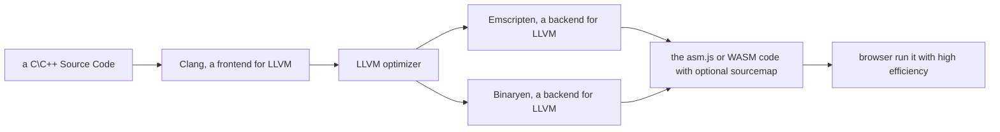

# WebAssembly(WASM) 概述

## 背景

浏览器是一个相当成功的跨平台环境，随着 Firefox（2004 - 2016 年）和 Chrome（2008 - 至今）对 Web 平台的称霸，以及 IE 的没落（2022 年微软宣布正式关停 IE），越来越多的 PWA(Progressive Web App) 在浏览器上遍地开花，但是由于 JavaScript 运行效率的问题，浏览器上很难跑大型应用，而将大型应用（比如微软的在线 VSCode 编辑器）甚至把大型游戏搬上浏览器一直是浏览器和前端开发工程师的终极目标。

2012 年，Firefox 母公司 Mozilla 的工程师 Alon Zakai 在研究 LLVM 编译器工具链时，突发奇想，能否把 C\C++ 代码转译为对应的高效率的 JavaScript 代码，毕竟 JavaScript 语言也参考了 C\C++，而 C\C++ 是写大型应用和游戏的首选语言。

于是乎，一个名为[Emscripten](https://github.com/emscripten-core/emscripten)的项目由此诞生，将 C\C++ 代码编译为高度优化的 JavaScript，这个规范叫做 asm.js。

无独有偶，当时如火如荼（2016 年以前）的 Adobe Flash 同样存在一个叫做 Mandreel 的框架，使用 C\C++ 来创建 Adobe Flash\AIR 应用，类似地，把 C\C++ 代码编译为高度优化的 ActionScript3 代码，从而能直接调用原生的 OpenGL 来开发高效率的 2D 和 3D 游戏。

## 实现 asm.js 的难点

C\C++ -> JavaScript 有两个最大的难点：

1. 前者是静态语言，后者是动态语言
2. 前者是手动垃圾回收，后者是自动垃圾回收

而`asm.js`使用下列方法来解决：

1. 保证变量类型不会发生突变，而且仅支持定义的 2 种类型（signed int 和 signed double）
2. 取消自动垃圾回收机制（使用 ArrayBuffer 模拟内存）

## 浏览器上的 asm.js

当浏览器识别到是 asm.js 规范的 JavaScript 代码时（如果浏览器不认识 asm.js，比如 IE，也没关系，因为 asm.js 只是 JavaScript 高度优化的子集，按照未优化的代码继续执行），就会跳过常规的词法分析、语法分析、构建 AST 等步骤，直接生成对应的汇编代码，还可能调用 WebGL 借助 GPU 执行 JavaScript 代码，asm.js 在 V8 引擎下的效率接近了原生程序的 50 ~ 80%。

慢慢地，各大浏览器厂商都接受了 [asm.js 规范](http://asmjs.org/spec/latest/)，接着，asm.js 演变成了 [WebAssembly](https://webassembly.org/)（简称 WASM），**一种直接运行在浏览器上的二进制代码，相当于 Java 的字节码**。

## LLVM

### 编译器前置知识

传统的编译器架构（代表：GCC）
编译器的前端：将编译器支持的各种语言的源代码做词法分析、语法分析和 AST 构建，生成与源代码相关但是与目标机器平台不相关的中间代码
编译器的后端：将中间代码优化同时生成目标机器平台的二进制文件
在前端和后端中间可以插入插件（中间件），以延长编译的过程。

最初 LLVM(Low Level Virtual Machine) 是伊利诺伊大学厄巴纳香槟分校的学生 Chris Lattner 研究编译器优化时搭建的一个底层指令和代码的运行时环境，不过这个虚拟机内建了一套中立的中间代码（即 LLVM IR），并围绕此中间代码提出了一套全新的编译架构，随着关于此虚拟机的论文一发表，这套编译架构越来越出名，慢慢地 LLVM 不再指代此虚拟机，而是指代了这套编译架构。

基于 LLVM 架构的编译器：
统一中间代码为 LLVM IR(Intermediate Representation) 格式，每个新的语言只需要实现自己对应的前端插件（将源代码编译为 LLVM IR），每个新的机器平台也只需要实现自己对应的后端插件（将 LLVM IR 编译为对应机器平台的二进制文件）。

LLVM IR 的优化由 LLVM 自己实现，当然可以传入自定义的优化配置，甚至可以编写自己需要的优化策略的插件。

相比之下，基于传统架构的 GCC 编译器的前后端高度耦合，不能很方便地支持一门新的语言或一个新的机器平台。

### 使用 LLVM 编译 WASM 的流程图



### 代码示例：在 C 语言代码里面执行 JavaScript 代码

```c
#include <emscripten.h>
#include <stdio.h>

int main() {
  short origin = 20;
  /**
    使用宏EM_ASM_INT执行一段JavaScript表达式（必须使用大括号包围起来），允许传入来自C代码的参数，例如下面的$0表示将C代码的origin变量作为参数传入，返回对应的结果
   */
  short res = EM_ASM_INT({ return $0 * 2; }, origin);

  printf('%d\n', res);

  return 0;
}
```

## Emscripten 概述

摘自[Emscripten](https://emscripten.org/)官网的概述：

Emscripten is a complete Open Source compiler toolchain to WebAssembly. Using Emscripten you can:

1. Compile C/C++ code, or any other language that uses LLVM, into WebAssembly, and run it on the Web, Node.js, or other wasm runtimes.
2. Compile the C/C++ runtimes of other languages into WebAssembly, and then run code in those other languages in an indirect way (for example, this has been done for Python and Lua).

翻译：

1. 将 C/C++代码或任何其他使用 LLVM 的语言编译为 WebAssembly，并在 Web、Node.js 或其他 wasm 运行时上运行这些代码。
2. 将其他语言的 C/C++运行时编译为 WebAssembly，最终间接地运行这些语言的代码（例如，Python 和 Lua 已经这样做了）。

其他非平台的原生语言，即需要运行时的语言，在编译为 WASM 时，首先需要把它的运行时编译为 WASM，这就大大增加了 WASM 文件的尺寸，效率也会打折扣。

比如 Python 编译为 WASM，实际上是把 CPython（C 语言实现的 Python 编译器）编译为了 WASM，在基于此 WASM 的运行时上执行 Python 代码。

## 支持编译为 WASM 语言的清单列表

https://github.com/appcypher/awesome-wasm-langs
