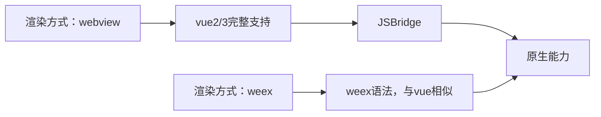

# uniapp 基本思想

## 开发小程序的基本思想（以微信小程序为例）

**下面的小程序指的都是微信小程序，且 uniapp 选择 Vue2.6.10 的版本。**

### 微信小程序基本架构概述

**微信小程序的本质是一个【与微信高度耦合】且【基于微信高度优化】的 WebView。**

通常，webview 指代一个完整的浏览器内核，包括了【JS 引擎】和【渲染引擎】。

起初，微信对它内置的 webview 暴露了一个名叫`wx`的`JSBridge`接口，能够唤起微信的原生功能，比如：

```js
wx.previewImages({
  // 唤起微信原生的图片浏览器
  default: './fruit.jpg',
  imgs: ['./banana.jpg', './apple.jpg'],
  success: () => {},
  error: () => {},
})
```

传统网页的【JS 执行】和【渲染】是互斥关系，又由于移动端性能普遍较低（微信小程序最早推出是 2015 年，移动端性能都不高），长时间执行的 JS 脚本会使得界面没响应，严重影响用户体验，所以，当时微信小程序提出将【JS 执行】和【渲染】独立出来到各自的线程中，并发运行。

由于【JS 引擎】从 webview 独立出来了，意味着它变成了一个很纯粹的 JS 解释器，也就意味着在微信小程序的 JS 代码里无法访问任何与 dom 和 bom 相关的方法，也就使得著名的 jQuery 无法在小程序上运行，同时，iOS 端的 JavaScriptCore 和 Node.js 的 V8 也不尽相同，有些 npm 包可能无法正常运行。

不同平台对应的 webview：

| 平台           | 逻辑           | 渲染                       |
| -------------- | -------------- | -------------------------- |
| iOS            | JavaScriptCore | WKWebView                  |
| Android        | V8             | 基于 Chromium WebView 定制 |
| 微信开发者工具 | NWJS           | Chrome WebView             |

### 概述

uniapp = 数据使用 vue 管理 + 视图依旧（也只能）由小程序管理

uniapp = 编译时（将 vue 编写的项目转成符合微信小程序格式的项目） + 运行时（代理小程序的相关行为到对应的 vue 方法，比如代理小程序的事件和生命周期钩子）

小程序的 setData 用法与 React 的 setState 相同，但是小程序的 setData 是同步的，每次 setData 都会触发一次更新，也就导致了连续多次的 setData 不会合并。

一次 setData 的过程：

1. 【逻辑线程】改变当前组件对应依赖的值，触发组件的生命周期钩子和其他副作用，异步发送数据（即一次渲染更新请求）到渲染线程
2. 【逻辑线程 -> 渲染线程】数据 -> 编码数据 -> 传输数据（IPC 通信）
3. 【渲染线程】接受数据 -> 解码数据 -> 对 vdom 进行 diff+patch -> 更新真实 dom

具体的数据编码方式不清楚（官网没有给出），可能是 JSON，也可能是结构化克隆算法，或其他的私有实现。

小程序的逻辑线程和视图层相互独立，两者使用 IPC 通信，数据需要经过【编码】 -> 【传输】 -> 【解码】，所以每次 setData 都是一次高成本操作。

如果渲染线程正忙，那么多出的更新请求将保存在消息队列里进行等待，**渲染线程一次只处理一个更新请求**。

要提高性能，优化 setData 是一个关键，有如下一些优化手段：

1. 减少 setData 的次数，降低通信频率：

   ```js
   setData({ x: 1 })
   setData({ y: 2 })
   ```

   合并两次 setData 为一次

   ```js
   setData({ x: 1, y: 2 })
   ```

2. 减少 setData 一次的数据量，降低通信成本：

   ```js
   const newList = [1, 2]
   setData({
     // 会传递全部的list，其实旧的list里面的元素不需要在再次传递了
     list: [...this.list, ...newList],
   })
   ```

   变成

   ```js
   setData({ // 只值传递新增的值，数组长度length会自动增加
     list[2]: 1,
     list[3]: 2,
   })
   ```

3. 与渲染不相关的数据不要放在 data 里面，可以直接定义在组件实例上，比如`this.staticStore = { key: '' }`
4. 和 React 一样，setData 会引起自身和其全部子组件的更新，要控制最小的更新范围，避免过深的状态提升，也可以结合 CSS 的`contain`一起使用来控制更新范围
5. 当小程序切到后台时（onHide 事件）避免 setData 操作，所有需要的更新先记下来，当小程序再次切回前台（onShow 事件）时一次性 setData

运行时的代理举例：

1. 代理小程序的事件（在编译时就被处理了，写在 vue 模板的事件被编译为对应的小程序事件名，再统一代理到事件处理方法`__e`）
   比如 vue 的：
   `<button @click="titleChange()">clickme</button>`
   编译的微信小程序：（在`data-event-opts`上记录【小程序事件名与它对应的 vue 的 methods 定义的事件处理器】的映射表）
   `<button data-event-opts="{{[['tap',[['titleChange']]]]}}" bindtap="__e">clickme</button>`
2. 代理小程序的生命周期（在编译时就被处理了，比如在小程序的 onReady 钩子里还将触发 vue 的 mounted 钩子）
3. 代理数据的变化，拦截 Vue2 在`flushSchedulerQueue`时的`watcher.run`（因为 vdom 和真实 dom 的 patch 不由 Vue 完成，而是由小程序自己完成）方法，转而对当前 watcher 对应的组件发生改变的数据的最小量统一进行一次小程序的 setData

总结：

改写 vue 的 patch 方法，复习一下 patch 方法的执行栈：

1. a dependence changed
2. setter of the dependence run dep.notify
3. run watcher.update
4. run queueWatcher(watcher), and the watcher is a render watcher of a component whose dependence changed
5. --nextTick trigger--
6. run fluashSchedulerQueue
7. run watcher.run
8. run watcher.get
9. run updateComponent
10. run vm.\_update(vm.render())
11. run patch(oldVNode, newVNode)

此 patch 只 diff 新旧的数据，由于两者的组件实例相互引用，即`vueInstance.$wxInstance <--> wxInstance.$vue`，当 Vue 组件更新了，从`vueInstance.$data`得到最新的值，从`wxInstance.$data`得到上一次的值，新旧值进行 diff，得出最小数据变化量，再一次性执行 `wxInstance.setData`，由于执行了 setData，`wxInstance.$data`也最新了。

由于 Vue 不再执行正在的 diff+patch，不需要 VNode 也不需要 render 函数以及其他有关的操作，降低了 30% 的 Vue 代码量。

### `uniapp(vue2) -> 微信小程序` 打包输出的项目源码分析

[See document.](./uniappVue2ToWX.md)

## 开发原生 APP 的基本思想

uniapp 对原生 APP 支持方式：



**weex 就是 vue 版本的 ReactNative**。
