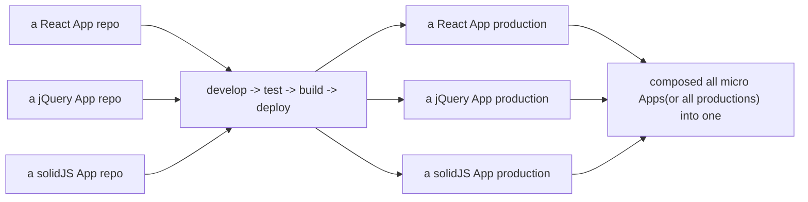

微前端的概念借鉴自后端的微服务：一种软件开发的架构，其中，软件的后端由数个小而独立的子服务组成，每个子服务由各个独立的团队负责，图示：

微前端：

Techniques, strategies and recipes for building a modern web app with multiple teams that can ship features independently.

微前端是一种多个团队通过独立发布功能的方式来共同构建现代化 web 应用的技术手段及方法策略。

图示：

微前端架构具备以下几个核心价值：

1. 技术栈无关
   主框架不限制接入的子应用（即微应用）的技术栈，微应用具备完全自主权。

2. 独立开发与部署
   微应用是独立的仓库，前后端可独立开发，每次发版完可以通知主框架同步更新。

3. 增量升级或重构
   在面对各种复杂场景时，我们通常很难对一个已经存在的系统做全量的技术栈升级或重构，而微前端是一种非常好的实施渐进式重构的手段。

4. 独立的运行时环境
   主框架会对每个微应用分配独立的全局运行时环境（独立且隔离的 全局对象 window、CSS 样式、JavaScript 脚本、等等）。

微前端架构旨在解决单体应用在一个相对长的时间跨度下，由于参与的人员、团队的增多、变迁，从一个普通单体应用演变成一个巨石应用，随之而来的就是应用不可维护的问题。尤其是企业的中后台应用（它们的存活时间通常大于等于 5 年）。
